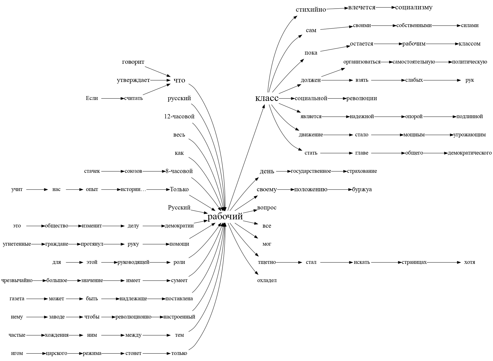

# Дерево слов

!!! info ""
    **ruts.visualizers.wordtree()**

## Описание

Построение [дерева слов](https://www.weblyzard.com/word-tree/) (Word Tree), отображающее контекст для заданного ключевого слова в тексте.

!!! note "Примечание"
    Более подробно с деревом слов можно ознакомиться в данной [публикации](https://www.cg.tuwien.ac.at/courses/InfoVis/HallOfFame/2011/Gruppe05/Homepage/Paper/wordtree-paper-wattenberg.pdf).

## Параметры

| Параметр | Тип | По умолчанию | Описание |
| :------: | :-: | :----------: | :------: |
| `texts` | List[List[str]] | `-` | Список списков слов |
| `keyword` | str | `None` | Ключевое слово, по которому ищется контекст |
| `max_n` | int | `5` | Максимальные размер контекста |
| `max_per_n` | int | `8` | Максимальное число примеров для каждого размера контекста |

## Пример использования

Рассмотрим работу визуализатора на примере 100 текстов из набора данных [StalinWorks](../datasets/stalinworks.md).

!!! example "Пример"

    _Код_:

    ``` python
    # Загрузка библиотек
    import tempfile
    from ruts import SentsExtractor, WordsExtractor
    from ruts.datasets import StalinWorks
    from ruts.visualizers import wordtree

    # Подготовка данных
    sw = StalinWorks()
    se = SentsExtractor()
    we = WordsExtractor(min_len=3)
    texts = [text for text in sw.get_texts(limit=50)]
    text = '\n'.join(texts)

    # Подготовка списка списков слов
    words = []
    for text in texts:
        sents = se.extract(text)
        for sent in sents:
            words.append(we.extract(sent))

    # Построение графика
    g = wordtree(words, "рабочий", max_n=6)

    # Сохранение визуализации на диск
    g.view(tempfile.mktemp(".gv"))
    ```

    _Результат_:

    {: .center }

!!! warning "Предупреждение"
    Для просмотра визуализации необходимо установить инструмент `Graphviz`.